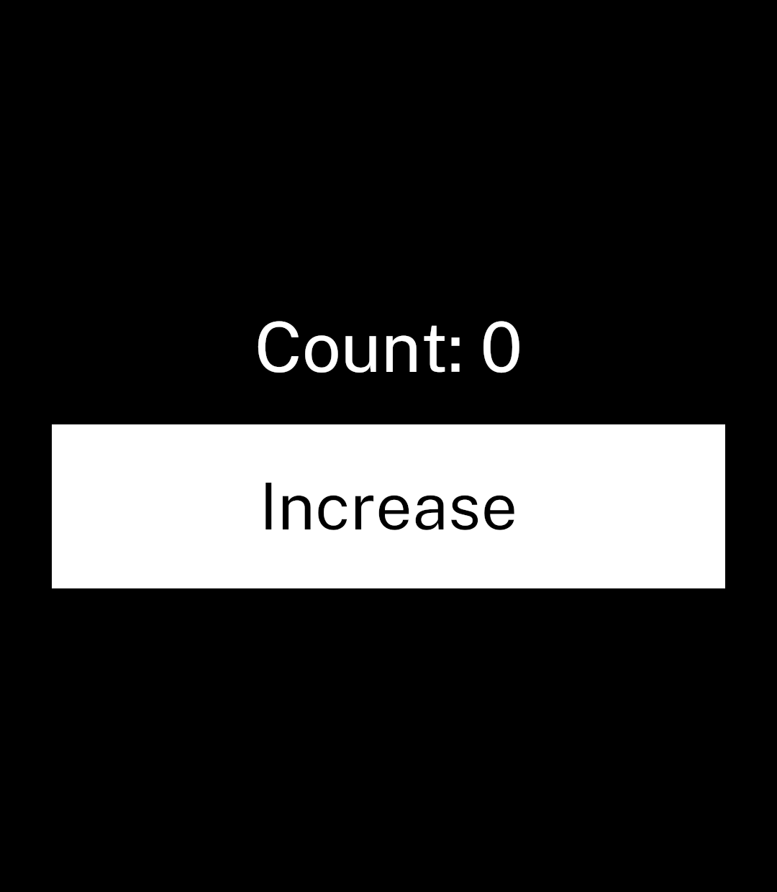

# Ink

Ink is an experimental Android UI framework for small Light Phone III apps. Apps are written in a deliberately restricted TypeScript/TSX dialect and compiled ahead of time into Rust. There is no JavaScript runtime in the APK.

The first vertical slice is a native component set rendered by `wgpu`, with Public Sans Regular rasterised into a small glyph atlas by Ink's compact text path.



## Counter

```tsx
import { Button, Screen, Stack, Text, state } from "ink";

export default function Counter() {
  const count = state(0);

  return (
    <Screen title="Counter" centered>
      <Stack gap={16} align="center">
        <Text size={40}>Count: {count.value}</Text>
        <Button onPress={() => count.set(count.value + 1)}>Increase</Button>
      </Stack>
    </Screen>
  );
}
```

## Commands

- `ink check` validates the application without producing build artefacts.
- `ink build` produces an optimised, release-signed APK in `dist/`.
- `ink build --debug` produces an automatically development-signed APK.
- `ink dev` builds, installs and launches the application, then watches for changes.
- `ink devices` lists connected devices and the remembered default.
- `ink logs` streams package-scoped application and crash logs.
- `ink info` shows resolved application, signing, device and build information.
- `ink doctor` checks the Rust and Android development environment.

Ink discovers `ink.toml` from the current directory. Use `ink -C <directory> <command>` to work with an application elsewhere, such as `ink -C examples/counter dev` from this repository's root.

`ink dev --logs` keeps Logcat alongside the development watcher. Use `--device <serial-or-name>` to select a device; Ink remembers its serial for later commands.

## Application metadata

Application identity and Android versioning live in `ink.toml`:

```toml
name = "Counter"
package = "com.vandam.counter"
version = "0.1.0"
version_code = 1
```

Ink uses `App.tsx` as the application entry point. Generated Rust, launcher icons and other build inputs stay in the application's ignored `.ink/` directory; their paths are framework implementation details.

Debug builds use Android's local development key automatically. A release build requires non-secret key metadata in `ink.toml`:

```toml
[signing]
keystore = "release.jks"
key_alias = "upload"
```

Supply passwords through `INK_KEYSTORE_PASSWORD` and `INK_KEY_PASSWORD`; never store them in the repository. Ink asks Gradle to sign the APK and verifies the resulting signature before copying it to `dist/`.

The current signed, optimised arm64 APK is approximately 2.4 MB. The development APK is intentionally unoptimised and much larger.

Ink currently targets Android API 34 or newer. The saved LP3 emulator and physical LP3 builds are arm64-only.

Style values are authored directly in Ink's LP3 logical units. At the LP3's 1080-pixel width they match the template's established 2.55-pixel scale, without an application-side scaling helper.

## Components

- `Screen` owns the app header, content insets, vertical rhythm, overflow scrolling and scroll indicator.
- `Stack` arranges children vertically or horizontally with optional gap, alignment and distribution.
- `Text` uses Public Sans and always renders at the full foreground colour. It supports an optional size and alignment, but no opacity or muted-text styling.
- `TextInput` renders the established LP3 text-field treatment. Editing waits for the Light Keyboard adapter.
- `Button` is a text-first action with optional Material icon and underline.
- `Icon` accepts a Material icon name. Ink embeds only the icon masks referenced by the app.
- `Image` embeds a local PNG at compile time with `cover` or `contain` fitting.
- `Toggle` provides the established LP3 line-and-circle setting control.
- `Tabs` and `Tab` own the fixed bottom navigation bar and screen switching.

`examples/counter` is the smallest interactive example: one screen, one state value and one action. `examples/light-template` mirrors the three top-level template pages for visual comparisons with the React Native and Light SDK components.

## Status

Ink remains a deliberately narrow prototype. Editable text, Light SDK resources, Light Keyboard, nested screen navigation and persistence are not implemented yet. Those integrations will sit behind framework-owned adapters rather than expanding every component's surface.
