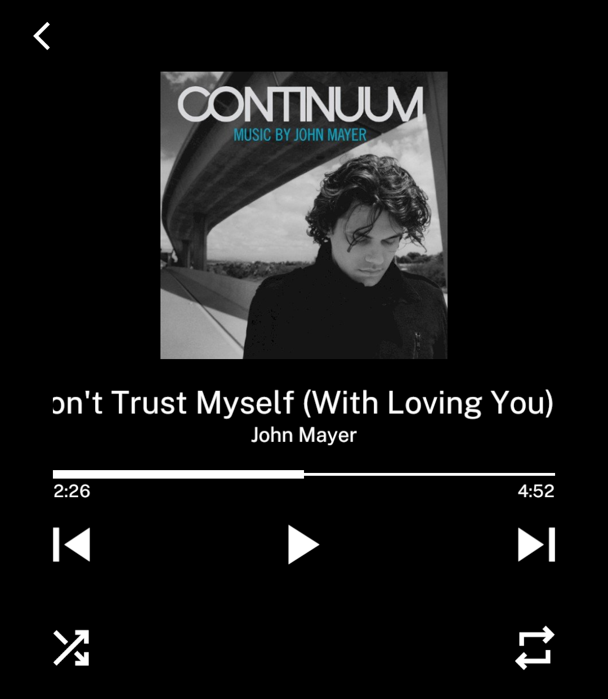
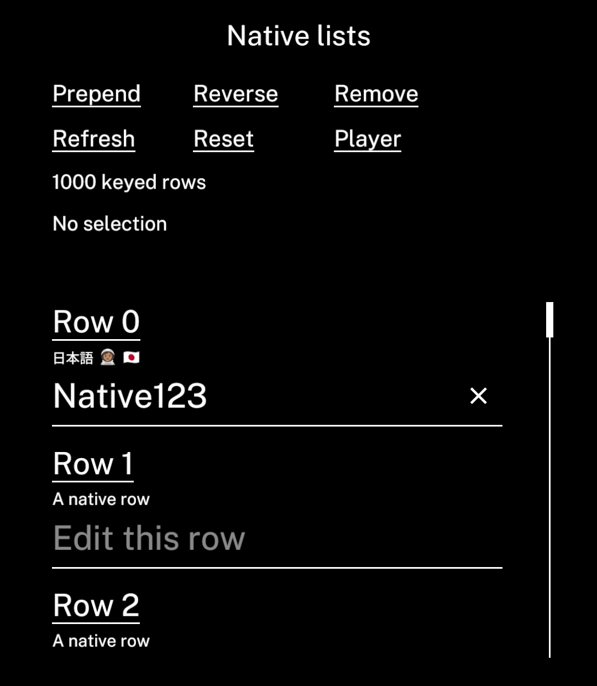

# Native lists and player controls — 28 September 2026

Rust now owns keyed row identity, viewport materialisation and player construction. JavaScript owns application data, fetching and meaningful actions. `view.list` is opt-in; existing React `List` rendering remains compatible. Existing `PlayingScreen` consumers use the native composite without an API migration. See [the API and ownership boundaries](../../../../docs/native-bindings.md).

## Measurements

| Workload | Mean | p95 | Boundary |
| --- | ---: | ---: | --- |
| 500 bound cells + resize, Mac | 0.265 ms | 0.298 ms | Input → CPU scene |
| 500 bound cells + resize, LP3 | 7.360 ms | 10.130 ms | Native pointer-up → frame submission |
| Replace 1,000 keyed records, Mac | 2.422 ms | 2.698 ms | JavaScript data update → visible native scene |
| Native list scrolling, Mac | 0.055 ms | 0.066 ms | Scroll + native window materialisation/layout |

The list workload renders a bounded window, so it is **not equivalent** to updating all 500 mounted cells. Its refresh replaces all 1,000 JSON records: JavaScript/transport averages 1.267 ms and native apply/layout 1.154 ms. Scrolling emits no JavaScript window callbacks. The complete list test process, including startup, 100 scroll steps, editing/recycling checks, 20 warm-ups and 200 measured updates, averages 0.551 seconds in five Hyperfine runs.

A four-round alternating desktop comparison (800 measured updates per variant) gave previous/current bindings means of 0.260/0.265 ms. Unchanged React gave 1.605/1.663 ms. This is a small increase in this sample, **not a speed improvement to React**; the remaining React route still reconciles in JavaScript. No compilation overlapped that paired comparison. Device UI checks were separate from its workloads.

LP3 results pool 30 updates after a separate 15-update warm-up. Median is 6.839 ms; maximum is 10.271 ms. Mean JavaScript/transport is 2.695 ms, apply/layout 1.369 ms, and commit-to-submission 2.917 ms. Submission is not physical panel response. The previous bindings validation averaged 7.404 ms with p95 10.408 ms; these small differences do not establish another speed gain.

Adding keyed-list and player machinery increases the same binding fixture's native library from 2,549,888 to 2,620,344 bytes (+70,456 B); APK from 2,726,892 to 2,797,400 bytes (+70,508 B). This change moves ownership and adds native functionality; it does not reduce this APK's size.

## Compatibility checks

- Four Rust tests pass: bounded native windows, keyed anchor/identity and event routing, pagination boundaries/follow-end/empty cleanup, and playback duration validation.
- Headless list checks cover prepend, reverse, delete, keyed callbacks, Japanese/emoji input through the real QuickJS callback, offscreen recycling, monotonic input acknowledgements and updated visible labels.
- Previous JS-composed and current Rust-composed players produce identical text, quads, mask geometry and sampled tap callbacks in normal, disabled, loading, zero-duration and image-layout fixtures. The image fixture checks layout only; image loading prevents synthetic taps until its resource arrives. Real artwork and navigation were checked on devices.
- LP3: keyboard entry, thumb drag to roughly row 548 and back, retained edited text, Japanese/emoji fallback rendering, seek, play/pause, transport long press and selected repeat action.
- Emulator template: native list insertion survives navigation into the player, title/artwork navigation, artist/action navigation and return. The shared player demo uses a 213,000 ms duration.
- Emulator Reverb: isolated `com.vandam.benchmark.reverb` built from the user's source; media permission, album/track loading, artwork, fresh playback of a 4:52 track, pause, seek to 2:26, next track (4:02), and leave/return all worked. No Ink JavaScript or Android fatal errors in the captured final log. Existing installed Reverb and its data were not replaced.
- Ink, template, native-controls, Beeper and Reverb TypeScript checks pass. The real Beeper JavaScript compiler also succeeds.

## Bugs corrected while validating

- Linked applications could resolve automatic JSX runtime types separately from Ink's React augmentation. Explicit runtime namespace augmentations fix Beeper's intrinsic `Text` errors without a runtime wrapper or Beeper source edits.
- The new player initially passed milliseconds through a layout validator capped at 100,000. Playback uses a dedicated finite, non-negative time validator now, including durations well above 100 seconds. The previously installed emulator Reverb did not reproduce the user's earlier duration error; this concrete new-player bug was independently identified and fixed.
- Native `TextInput` declarations now include keyboard capabilities; native image declarations and the player declare image/network requirements. Counter still omits unused capabilities.
- The Android text editor follows native-only scrolling and disappears when its row is recycled, preventing an old overlay from remaining on screen. Input acknowledgement counts survive remounting.
- Headless Cargo metadata parsing now separates stderr, so Cargo's cache-lock diagnostics cannot corrupt its JSON output.

## Evidence and reproduction

Final APK source snapshot: `experiment-20260928-152019-97ae2904`. All four APKs use `INK_BRIDGE_TIMING=1`. The immutable archive contains the temporary external Reverb validation copy and isolated package IDs. Temporary workspace/config changes were restored afterwards.

List harness: `headless-20260928-152732-1c141867`. Binding fixture assets: `headless-20260928-151451-68d8f858`. React comparison binary: `headless-20260928-151859-079a26a9`. Before binaries: `headless-20260928-142031-bc9472d4` and `headless-20260928-142053-a216c34f`. The final list binary also ran the ordinary binding workload in the paired comparison.

LP3 probes: `probe-20260928-152658-d9691a57`, `probe-20260928-152703-629af083`; warm-up `probe-20260928-152653-b9a3d90e`. APK hashes, source hashes, logs and complete raw artefacts remain under `.agent-tools/`. Published records: [headless list](list-headless.json), [paired desktop runs](paired-headless.json), [LP3 samples](lp3.json), [player equivalence](player-equivalence.json).

```sh
scripts/agent-tools headless --app benchmarks/apps/ink-native-controls --hyperfine --background
scripts/agent-tools headless --app benchmarks/apps/ink-views --hyperfine --background
cargo test -p ink-core --lib --locked --offline
```



