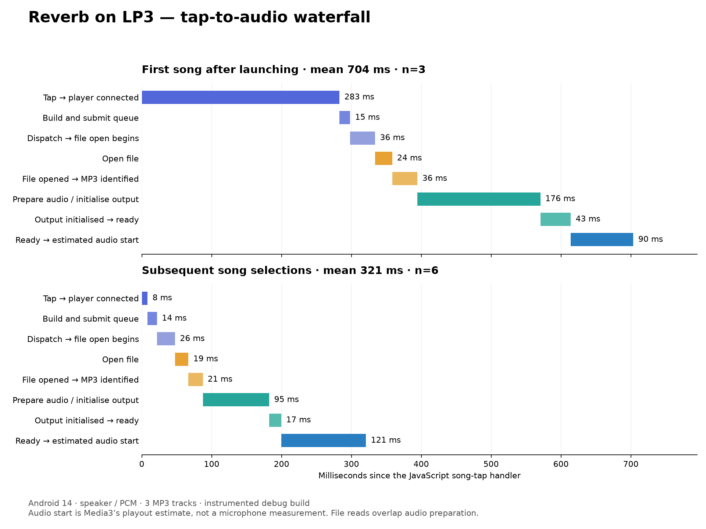

# Reverb loading waterfall on LP3

29 September 2026. Physical TLP301, Android 14, built-in speaker, PCM fallback with `c2.android.mp3.decoder`, 44.1 kHz stereo. Existing local MP3s: Man Overboard, No Feeling and Blood on My Blood from the first American Football album shown in the library. Three fresh-process launches, each followed by two subsequent selections. Thermal status was 0 before and after the run. No host builds ran during measurement.

## Sequential waterfall

Mean milliseconds. Stages sum to the total before rounding.

| Stage | First song after launch (3 samples) | Subsequent selection (6 samples) |
| --- | ---: | ---: |
| JS tap handler → player connected | 283.0 | 8.3 |
| Build and submit queue | 15.3 | 13.5 |
| Dispatch → file open begins | 35.7 | 25.8 |
| Open file | 24.5 | 19.1 |
| File opened → MP3 identified | 36.2 | 20.5 |
| MP3 identified → audio output initialised | 176.0 | 95.2 |
| Output initialised → player ready | 43.3 | 17.2 |
| Player ready → estimated audio playout starts | 89.7 | 121.3 |
| **Total** | **703.7** | **321.0** |
| Total range | 672–758 | 271–380 |

The preparation/output interval includes overlapping file extraction, codec configuration, thread scheduling and AudioTrack setup. The last stage is the interval between Android reporting READY and Media3's estimate of playout beginning; it must not be interpreted as a precise measurement of hardware latency alone.

## File-loading detail

These measurements overlap the waterfall above and must not be added to it:

| Operation | First song | Subsequent songs |
| --- | ---: | ---: |
| MP3 identification / initial metadata parse call | 11.1 ms | 18.4 ms |
| Cumulative DataSource reads through ~2.23 MB | 39.4 ms | 48.5 ms |
| Cumulative DataSource reads through ~3.28 MB | 94.9 ms | 87.7 ms |
| First 2,048 extractor reads, including underlying reads (~2.49 MB file position) | 104.4 ms | 98.0 ms |
| Codec initialisation | 58.3 ms | Decoder reused; no new initialisation event |

The first track's ID3v2 header declares **1,427,028 bytes including the header**. The first read sequence confirms this block is consumed before audio frames. The header was verified directly from the first ten file bytes (`49 44 33 04 00 00 00 57 0c 4a`). The contents of individual ID3 frames were not inspected, so the entire block should not be attributed to artwork without further inspection.

Read-ahead continues while audio is prepared and may continue after READY. The cost through 3.28 MB is therefore not a required pre-playback delay. These are elapsed read-call times, including provider, OS/cache and scheduling effects, not measurements of physical storage bandwidth. No filesystem caches were flushed.

## What is worth investigating

1. First selection: service/controller startup is the largest distinct cost at 283 ms. Connecting while browsing could move that cost earlier, but needs startup/idle-resource measurements.
2. Subsequent selection: preparation/output (95 ms) and READY-to-playout (121 ms) dominate. Profile decoder/AudioTrack reuse and scheduling before attributing these intervals to file loading.
3. File work is more material than on the emulator: opening, large ID3 blocks and thousands of small extraction reads warrant targeted buffered-read and metadata experiments. Preserve gapless/seek information; skipping all metadata is not justified.

No optimisation was applied in this profiling run. The LP3 and emulator samples use different files, so their totals are not a controlled hardware comparison.

## Method and cleanup

Applied the same [temporary profiling patch](../reverb-file-loading-2026-09-29/profiling.patch) to Reverb, built a debug APK and installed with `adb install -r` under an agent-tools device reservation. Started each round in a fresh process, opened the album, then selected its first three songs with three seconds of playback observation and back navigation between selections. All nine accepted samples reported audio position advancing. There were no playback errors, audio sink errors or underruns in their logs.

Start: `Date.now()` in the JS song-tap handler. End: Media3's `onAudioPositionAdvancing` argument `playoutStartSystemTimeMs`, **not the callback's later delivery time**. Both use the device wall clock. File/extractor call durations use `System.nanoTime()`. This excludes touch sensing and is not a microphone measurement of audible speaker onset. Instrumentation adds overhead; the sample is small and measures MP3 playback on the built-in speaker, not Bluetooth, offload or other formats.

Restored the original source by reversing the profiling patch. Saved and reinstalled the exact APK that was on the phone before profiling, without clearing app data. Paused playback and released the device reservation. Selection testing changed the active queue; it did not delete music or library data.

Evidence: [per-sample stages](stages.json), [filtered timing markers](markers.log), [vector waterfall](waterfall.svg). Full logcat and the original APK are retained locally under the ignored `.agent-tools/reverb-lp3/` directory. No APK is included in this report.
